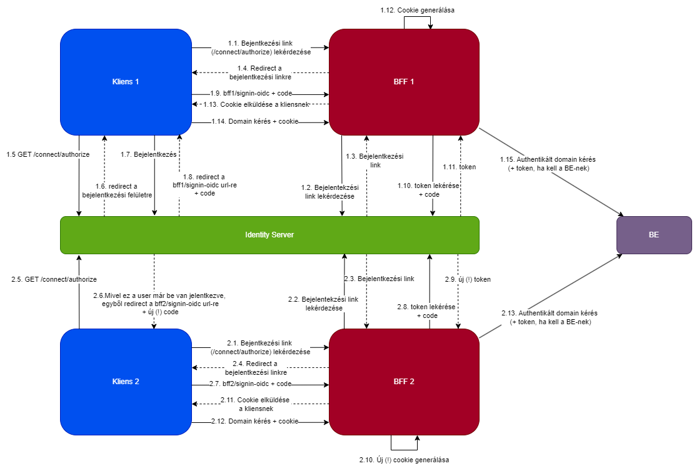

# BFF SSO Demo
Ez a demo a BFF és az SSO együttes működését mutatja be.

## Komponensek
Ez a demo 2 különböző alkalmazást szimulál, és összesen 6 különböző alkalmazás-komponensből áll, 
amik párhuzamosan futnak, és kommunikálnak egymással:
- Kliens 1 és Kliens 2
  - A `BffDemo.Bff1/BffDemo.Client1` és a `BffDemo.Bff2/BffDemo.Client2` mappa alatt találhatók
  - Ez 2 angular kliens, az előbbi a `localhost:4200` az utóbbi pedig a `localhost:4201` címen. 
  - Habár jelen esetben kódjukban szinte azonsak, ezek 2 teljesen független alkalmazásnak a klienseit szimulálják. 
- BFF 1 és BFF 2:
  - Ezek a BFF komponensei a 2 alkalmazásnak.
  - `localhost:5001` és `localhost:5002` címeken futnak.
  - Ezen template alapján készültek: https://github.com/DuendeSoftware/IdentityServer.Templates/tree/main/src/BffRemoteApi
  - Kódjukban ezek is nagyon hasonlóak, azonban ezek is 2 teljesen független alkalmazásnak a BFF komponenseit szimulálják
  - A kéréseket továbbítják a backend felé, pontosabban minden `localhost:5001/bff1/api1/[request]` vagy `localhost:5002/bff2/api2/[request]` címre érkező kérést továbbítanak a `localhost:6000/[request]` címre. Ez konfigurálható az `appsettings.json` file-ban. 
- Identity Server
  - Ez maga az identity server, ami bejelentkezteti a felhasználókat, és szolgáltatja a tokeneket.
  - Ezen template alapján készült: https://github.com/DuendeSoftware/IdentityServer.Templates/tree/main/src/IdentityServerInMem
  - `localhost:5000` címen fut
- Backend
  - Ez pedig egy egyszerű ASP.NET backend WEB API, amit mindkét alkalmazás authentikáltan hív
  - `localhost:6000` címen fut
## Folyamat

Az alábbi ábra szemlélteti azt a folyamatot, ami által a felhasználó mindkét alkalmazásba bejelentkezik, de az adatait csak az első alkalommal adja meg:


Az ábrában sorszámozva vannak a kérések, ezek olyan sorrendben hajtódnak végre. Az "1."-tal kezdődő sorszámmal rendelkező 
kérések jelentik az első alkalmazás bejelentkezési folyamatának a részét, a "2."-tal kezdődőek pedig a másodikét.

## Felhasználók

A teszt felhasználók a Duende által biztosított templateből származnak. 2 ilyen Felhasználó van:
- Alice
  - user: alice
  - pass: alice
- Bob
  - user: bob
  - pass: bob

## Futtatás előtt
Lokális futtatás előtt érdemes lehet az alábbi 2 sort beilleszteni a hosts file-ba, mert enélkül nekem nem működik:
- Windowson: `C:\Windows\System32\drivers\etc\hosts`
- Linux/MaxOS-en: `/etc/hosts`
```
127.0.0.1   bff1.localhost
127.0.0.1   bff2.localhost
```
Ezzel lényegében a 2 bff-et különböző címeken lehet elérni, mert az azonos url nevek (különböző portok ellenére) azt eredményezik,
hogy mind2 cookie (`__Host-bff1` és `__Host-bff2`) egy helyen legyen tárolva, és ezáltal nem fognak beleférni a kérésbe, 431 errort fogunk kapni

## Indítás

A teljes folyamat szimulálásához mind a 6 komponenst külön-külön el kell indítani.
- A BFF-eket, az Identity Servert és a Backend-et szokásos .NET projektként kell futtatni
  - Visual Studioban jobb klikk a projektre -> Debug -> Start New Instance
- A két angular klienst az alábbi módon érdemes futtatni:
  - Navigáljunk el a `BffDemo.Bff1/BffDemo.Client1` vagy a `BffDemo.Bff2/BffDemo.Client2` mappába,
  - majd futtasuk az `npm start` parancsot
